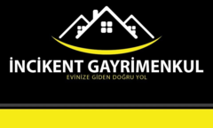
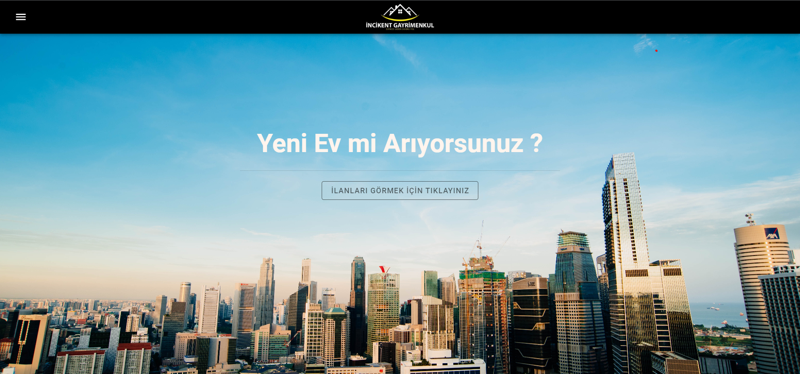
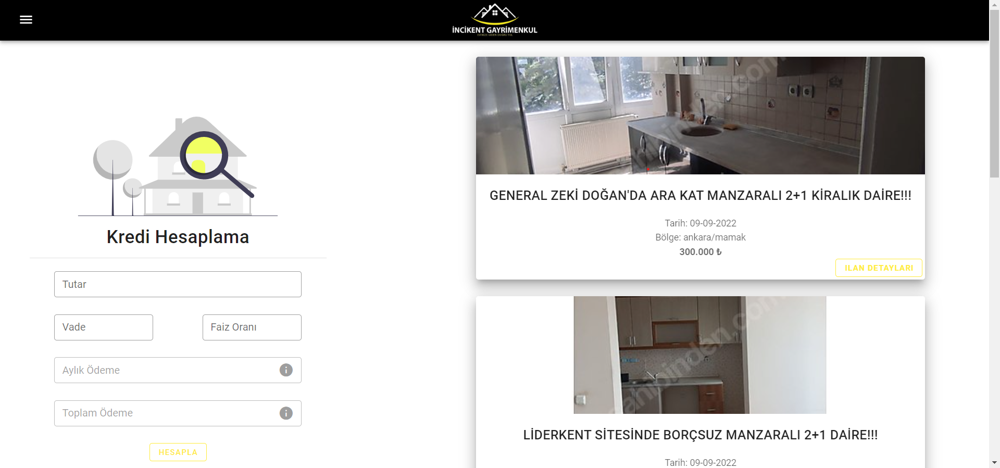
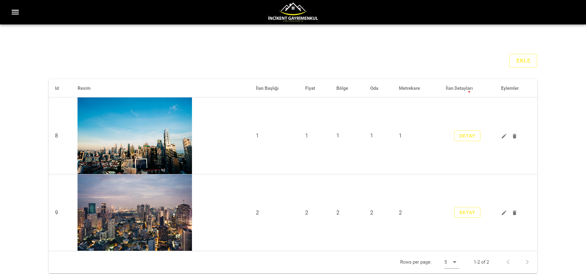
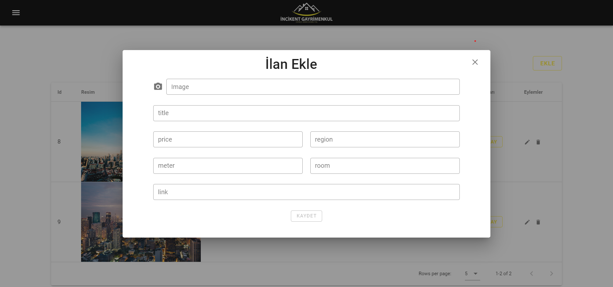
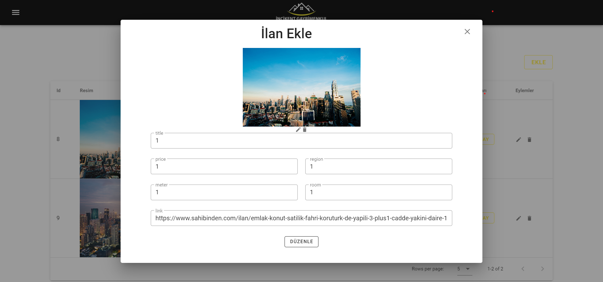
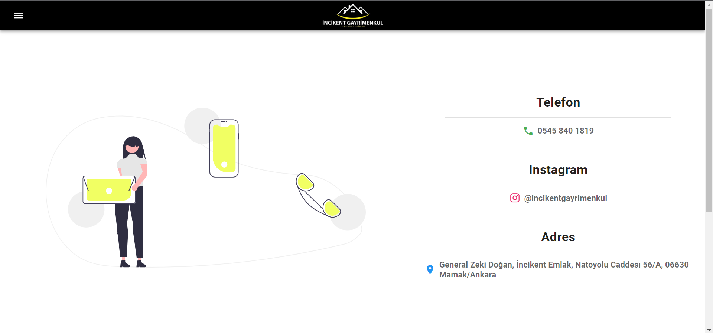
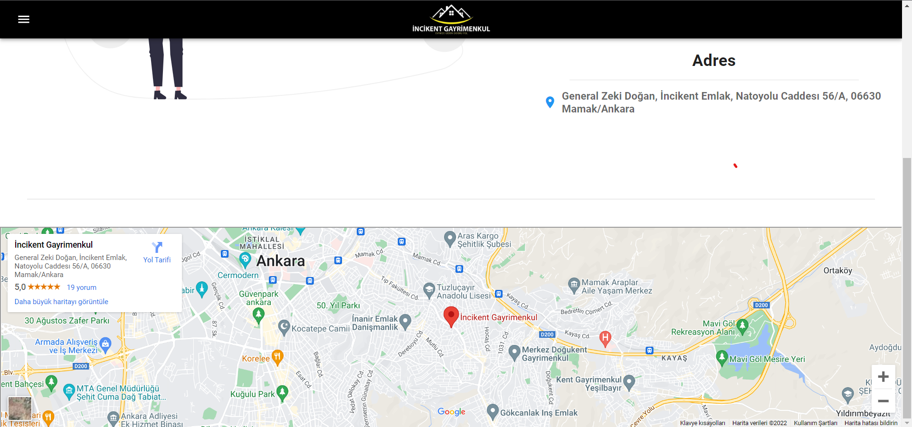

# İncikent Gayrimenkul Frontend

<!-- PROJECT LOGO -->
<div name="readme-top"  align="center">
  <a href="https://github.com/sefakrb/incikent-gayrimenkul-frontend">
    
  </a>
</div>


<br />
<br />


<!-- TABLE OF CONTENTS -->
<details>
  <summary>Table of Contents</summary>
  <ol>
    <li>
        <a href="#built-with">Built With</a>
    </li>
    <li>
      <a href="#getting-started">Getting Started</a>
      <ul>
        <li><a href="#prerequisites">Prerequisites</a></li>
        <li><a href="#installation">Installation</a></li>
      </ul>
    </li>
    <li><a href="#pages">Pages</a></li>
    <li><a href="#contact">Contact</a></li>
  </ol>
</details>


## About The Project

  This website is for [İncikent Gayrimenkul](https://incikentgayrimenkul.sahibinden.com/) which is a real estate consultant in Ankara/Turkey


### Built With

* [![Vue][Vue.js]][Vue-url]
* [![Nuxt][Nuxt]][Nuxt-url]


<p align="right">(<a href="#readme-top">back to top</a>)</p>

## Getting Started

### Prerequisites

* npm
  ```sh
  npm install npm@latest -g
  ```

### Installation

1. Clone the repo
   ```sh
   git clone https://github.com/sefakrb/incikent-gayrimenkul-frontend.git
   ```
2. Install NPM packages
   ```sh
   npm install
   ```
3. Create your own `.env` file as in `.env.example` file
   ```js
   BASE_URL= "http://localhost:3000";
   BACKEND_URL= "http://localhost:8080";
   ```
4. Build Setup 
   * Run on development mode
     ```sh
     npm run dev
     ```
   * Build for production and launch server
      ```sh
      npm run build
      npm run start
      ```

<p align="right">(<a href="#readme-top">back to top</a>)</p>

## Pages
#### Home
  
  
#### Dashboard
  
  
#### All Advertisements
  
  
#### Add Advertisements
  
  
#### Edit Advertisements
  
  
#### Contact
  
  
  

<p align="right">(<a href="#readme-top">back to top</a>)</p>


## Contact
Sefa Karabaş - sefa799@gmail.com
Project Link: [https://github.com/sefakrb/incikent-gayrimenkul](https://github.com/sefakrb/incikent-gayrimenkul-frontend)

<p align="right">(<a href="#readme-top">back to top</a>)</p>

<!-- MARKDOWN LINKS & IMAGES -->
<!-- https://www.markdownguide.org/basic-syntax/#reference-style-links -->
[Vue.js]: https://img.shields.io/badge/Vue.js-35495E?style=for-the-badge&logo=vuedotjs&logoColor=4FC08D
[Vue-url]: https://vuejs.org/
[Nuxt]: https://img.shields.io/badge/Nuxt-002E3B?style=for-the-badge&logo=nuxtdotjs&logoColor=#00DC82
[Nuxt-url]: https://nuxtjs.org/

